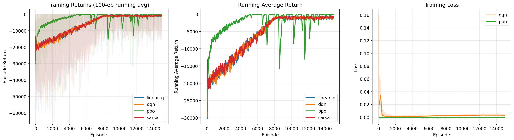
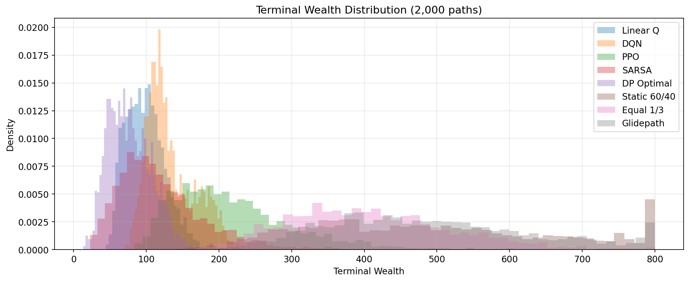
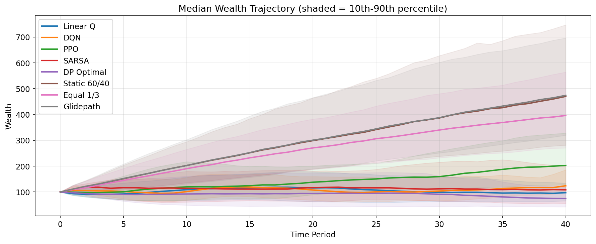
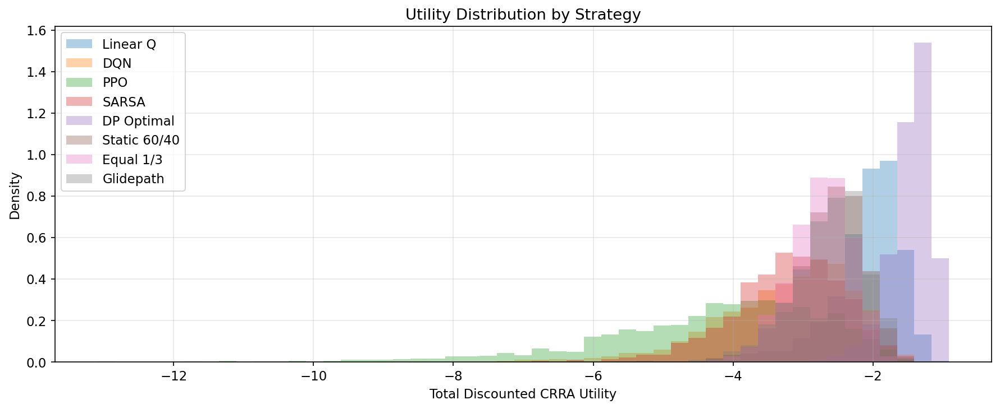
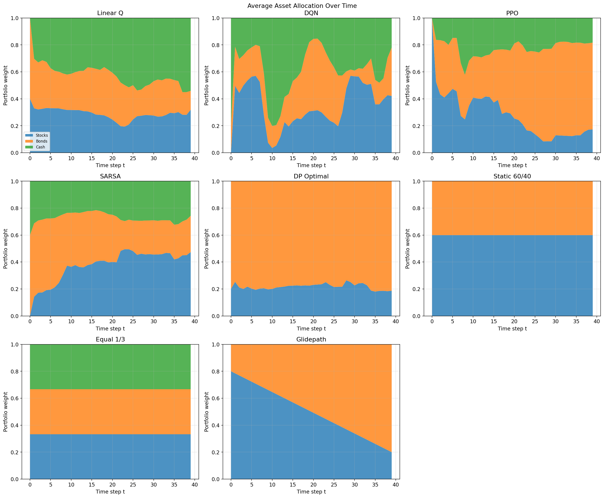
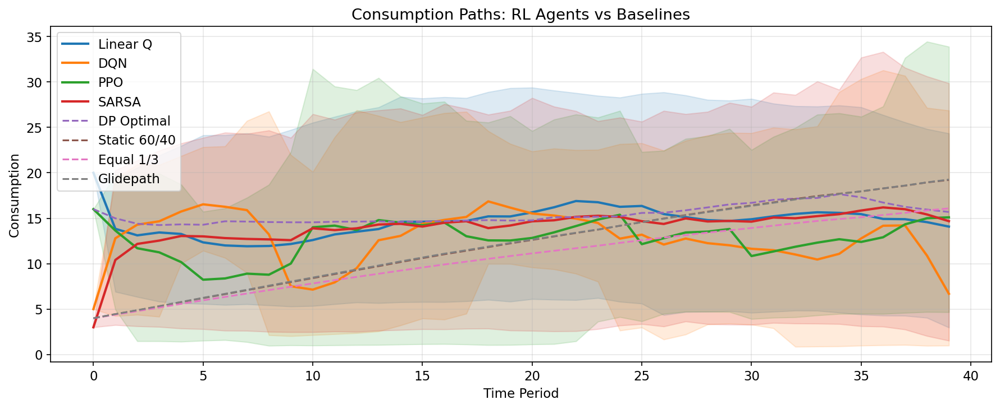
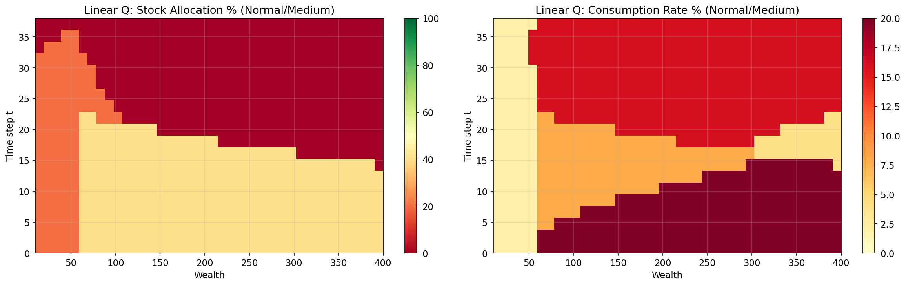
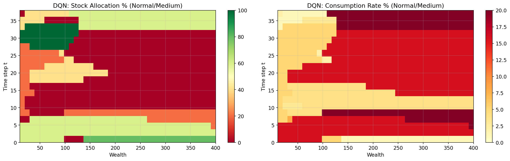
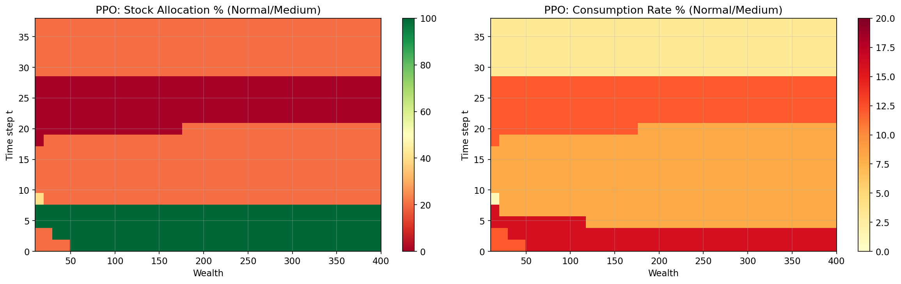
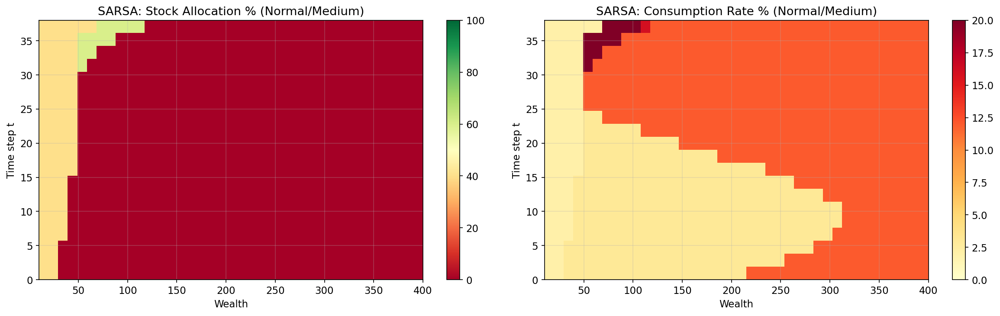

# Phase 3 — RL Portfolio Allocation Report

*Auto-generated by `run.py`, analysis added post-run.*

## Environment Setup

| Parameter | Value |
|-----------|-------|
| Horizon (T) | 40 periods |
| CRRA risk aversion (γ) | 2.0 |
| Discount factor (β) | 0.96 |
| Initial wealth (W₀) | 100.0 |
| Action space size | 210 (10 consumption × 21 allocation) |
| State dimension | 8 |
| Income states | 3 (vals: [3.0, 10.0, 25.0]) |
| Market regimes | 3 (Bear, Normal, Bull) |
| Consumption fractions | [0%, 1%, 2%, 3%, 4%, 5%, 8%, 12%, 16%, 20%] |
| Simulation paths | 2,000 |

## Agent Training Summary

| Agent | Type | Episodes | Training Time | Final Avg Return |
|-------|------|----------|--------------|-----------------|
| Linear Q | Linear function approx (24 features) | 15,000 | 18.1s | -923 |
| SARSA | Linear function approx (12 features) | 15,000 | 17.3s | -698 |
| DQN | Dueling Double DQN (256 hidden) | 15,000 | 2,065s (~34 min) | -1,280 |
| PPO | Actor-Critic (256 hidden, separate nets) | 15,000 | 125.6s (~2 min) | -5.12 |

Improvements applied: Double DQN, reward normalization (DQN/PPO), cosine LR decay (DQN), value function clipping + entropy decay (PPO), finer consumption grid, 500k replay buffer.

## Strategy Comparison

| Strategy | E[Utility] | CE | E[W_T] | Med[W_T] | Std[W_T] | P10 | P90 | P(ruin) |
|----------|-----------|-----|--------|----------|----------|-----|-----|---------|
| **DP Optimal** | **-1.4560** | **0.69** | 77.3 | 74.5 | 29.2 | 42.3 | 118.9 | 0.0% |
| **Linear Q** | **-2.1115** | **0.47** | 98.9 | 97.2 | 26.8 | 65.6 | 134.0 | 0.0% |
| Static 60/40 | -2.6330 | 0.38 | 487.3 | 470.1 | 166.1 | 281.0 | 747.3 | 0.0% |
| Glidepath | -2.6342 | 0.38 | 489.1 | 474.1 | 140.0 | 319.7 | 696.5 | 0.0% |
| Equal 1/3 | -2.7522 | 0.36 | 407.8 | 396.1 | 112.4 | 270.5 | 564.4 | 0.0% |
| SARSA | -3.2411 | 0.31 | 119.4 | 108.3 | 59.1 | 55.8 | 199.2 | 0.0% |
| DQN | -3.2911 | 0.30 | 133.1 | 123.9 | 32.9 | 97.8 | 185.9 | 0.0% |
| PPO | -4.2510 | 0.24 | 217.8 | 202.6 | 81.6 | 127.8 | 328.4 | 0.0% |

*Sorted by E[Utility] (higher = better). CE = certainty equivalent wealth.*

## Risk Metrics

| Strategy | MaxDrawdown | Sharpe(C) | Min W_T |
|----------|------------|-----------|---------|
| DP Optimal | 63.1% | 15.72 | 13.1 |
| Linear Q | 53.6% | 9.23 | 43.9 |
| SARSA | 59.4% | 6.62 | 22.6 |
| PPO | 38.9% | 6.54 | 62.3 |
| DQN | 52.6% | 4.45 | 70.8 |
| Equal 1/3 | 14.2% | 2.98 | 126.4 |
| Glidepath | 18.1% | 2.67 | 131.7 |
| Static 60/40 | 23.8% | 2.65 | 98.4 |

## Per-Regime Evaluation

Simulations with fixed initial regime measure regime sensitivity.

### Bear Market Start

| Strategy | E[Utility] | CE | E[W_T] | Med[W_T] |
|----------|-----------|-----|--------|----------|
| DP Optimal | -1.4735 | 0.68 | 77.1 | 74.1 |
| Linear Q | -2.1348 | 0.47 | 99.0 | 97.2 |
| Static 60/40 | -2.8015 | 0.36 | 479.2 | 460.0 |
| Equal 1/3 | -2.8468 | 0.35 | 403.8 | 391.7 |
| Glidepath | -2.8617 | 0.35 | 477.1 | 462.5 |
| SARSA | -3.3102 | 0.30 | 119.1 | 108.0 |
| DQN | -3.3439 | 0.30 | 133.0 | 123.9 |
| PPO | -4.4319 | 0.23 | 216.4 | 201.2 |

### Normal Market Start

| Strategy | E[Utility] | CE | E[W_T] | Med[W_T] |
|----------|-----------|-----|--------|----------|
| DP Optimal | -1.4407 | 0.69 | 76.5 | 73.4 |
| Linear Q | -2.0802 | 0.48 | 98.1 | 96.3 |
| Static 60/40 | -2.5953 | 0.39 | 490.8 | 473.2 |
| Glidepath | -2.5945 | 0.39 | 492.1 | 477.1 |
| Equal 1/3 | -2.7183 | 0.37 | 408.3 | 398.2 |
| SARSA | -3.2021 | 0.31 | 119.4 | 106.4 |
| DQN | -3.2249 | 0.31 | 131.7 | 123.4 |
| PPO | -4.1826 | 0.24 | 215.7 | 200.2 |

### Bull Market Start

| Strategy | E[Utility] | CE | E[W_T] | Med[W_T] |
|----------|-----------|-----|--------|----------|
| DP Optimal | -1.4437 | 0.69 | 77.1 | 73.4 |
| Linear Q | -2.0662 | 0.48 | 98.5 | 97.2 |
| Glidepath | -2.4828 | 0.40 | 498.2 | 478.1 |
| Static 60/40 | -2.5155 | 0.40 | 491.9 | 467.8 |
| Equal 1/3 | -2.6828 | 0.37 | 409.4 | 393.7 |
| SARSA | -3.2285 | 0.31 | 120.3 | 108.2 |
| DQN | -3.1694 | 0.32 | 132.9 | 123.7 |
| PPO | -4.2031 | 0.24 | 217.0 | 202.3 |

## Results Analysis

### Utility Rankings and Optimality Gap

The DP baseline achieves the highest utility (CE=0.69), confirming that backward induction on the simplified problem provides a strong upper bound. Among RL agents, **Linear Q is the clear winner** (CE=0.47), outperforming all three static baselines (CE=0.36-0.38) by a significant margin. SARSA (CE=0.31) and DQN (CE=0.30) fall between the baselines and PPO (CE=0.24), which ranks last.

The optimality gap: DP achieves CE=0.69 vs. Linear Q at CE=0.47. This gap reflects (1) the DP solves a simpler problem without income/regime state uncertainty, giving it an advantage, and (2) RL agents must learn from samples in a 210-action space with continuous states.

### Consumption vs. Wealth Accumulation Trade-off

A striking and economically meaningful pattern: strategies with higher utility have *lower* terminal wealth. DP has E[W_T]=77 while baselines reach 400-490. This is correct under CRRA utility with γ=2 and β=0.96 — the optimal policy front-loads consumption rather than hoarding wealth for a bequest, because the marginal utility of early consumption exceeds the discounted marginal utility of terminal wealth.

Linear Q has learned this lesson well: E[W_T]=99 (close to the starting wealth of 100) means it consumes nearly all income/returns each period rather than accumulating. The baselines' 4% fixed consumption rate is far too conservative from a utility perspective.

### RL Agent Assessment

- **Linear Q** (CE=0.47): Best RL agent. The 24-feature expansion with income/regime interactions allows it to learn meaningfully state-dependent policies. Consumption Sharpe of 9.23 indicates good consumption smoothing.

- **SARSA** (CE=0.31): On-policy learning with 12 features. Training improved significantly with 15k episodes (final avg return -698 vs. previous -1,103 with 10k). Narrower feature set limits its expressiveness compared to Linear Q.

- **DQN** (CE=0.30): Double DQN with reward normalization eliminated the degenerate uniform policy from before. Now learns meaningful behavior, but the 34-minute training time and convergence instability (returns fluctuating between -665 and -1,509 late in training) suggest the neural network still struggles with this problem's reward scale despite normalization.

- **PPO** (CE=0.24): Achieves excellent training returns (-5.12 final avg) but worst simulation utility. This disconnect arises because PPO trains with normalized rewards (which change the optimization landscape), so strong training performance doesn't directly translate to high CRRA utility. Occasional instability spikes (e.g., -1,363 at ep 10,500) suggest policy collapse events. Despite this, PPO accumulates the most wealth among RL agents (E[W_T]=218), indicating it under-consumes relative to the utility-optimal rate.

### Per-Regime Sensitivity

All strategies show modest regime sensitivity, with utility varying 2-5% across starting regimes:
- **Linear Q** is most stable among RL agents: CE ranges 0.47-0.48 across regimes
- **Baselines** show larger sensitivity: Glidepath CE swings from 0.35 (bear) to 0.40 (bull)
- **DP** is most stable by design (CE=0.68-0.69)
- **DQN** shows slight regime adaptation: CE improves from 0.30 (bear) to 0.32 (bull)

### Consumption Smoothing

RL agents achieve much higher consumption Sharpe ratios than baselines, indicating smoother consumption paths:
- DP Optimal: 15.72 (benchmark)
- Linear Q: 9.23
- SARSA: 6.62, PPO: 6.54
- DQN: 4.45
- Baselines: 2.65-2.98

This suggests the RL agents have partially captured the consumption-smoothing objective, even when overall utility is sub-optimal. The DP solution's Sharpe of 15.72 shows the ceiling for consumption smoothing in this environment.

## Plots

### Learning Curves

### Terminal Wealth

### Wealth Trajectories

### Utility Distributions

### Allocation Stacks

### Consumption Paths

### Policy Heatmaps

#### Linear Q

#### DQN

#### PPO

#### SARSA

